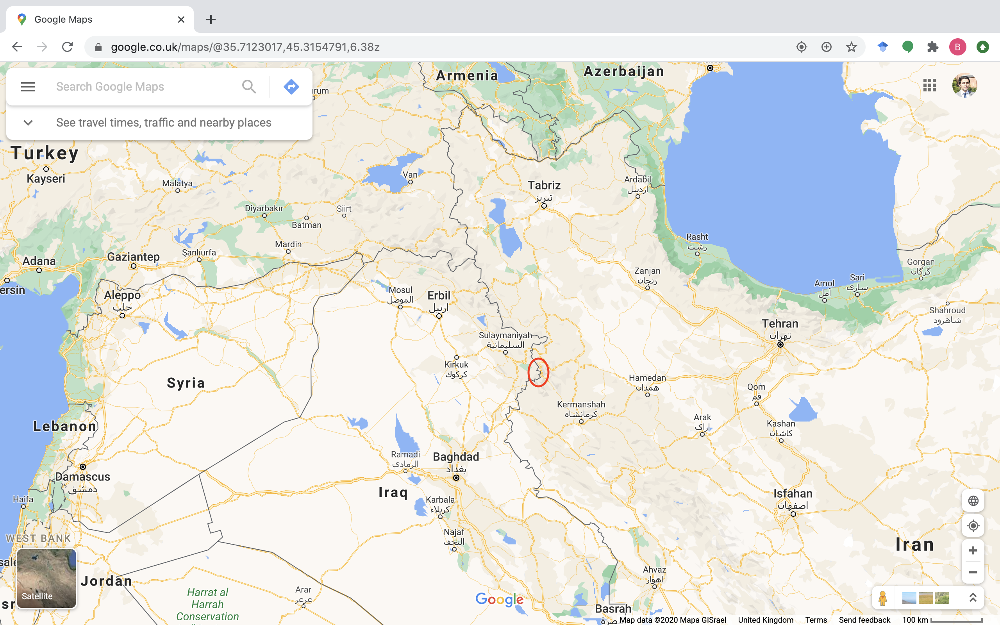
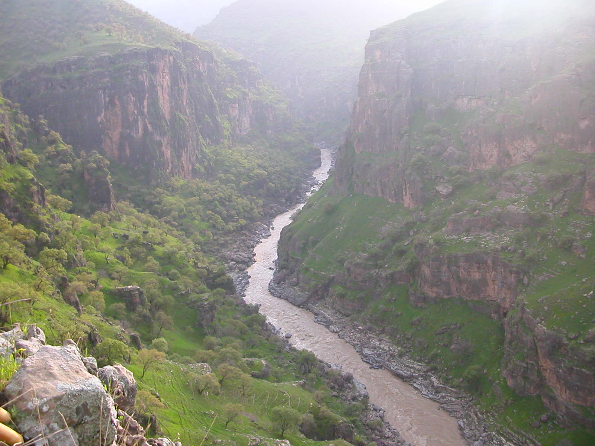
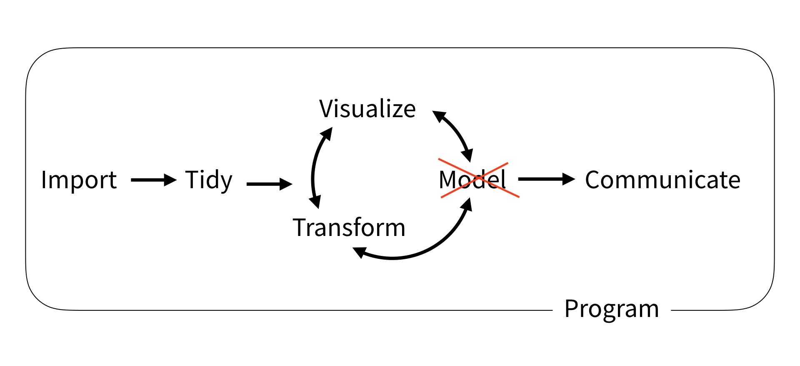
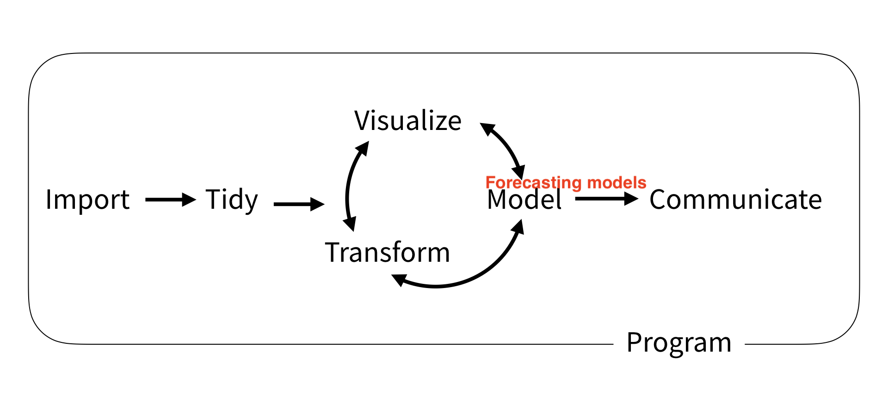
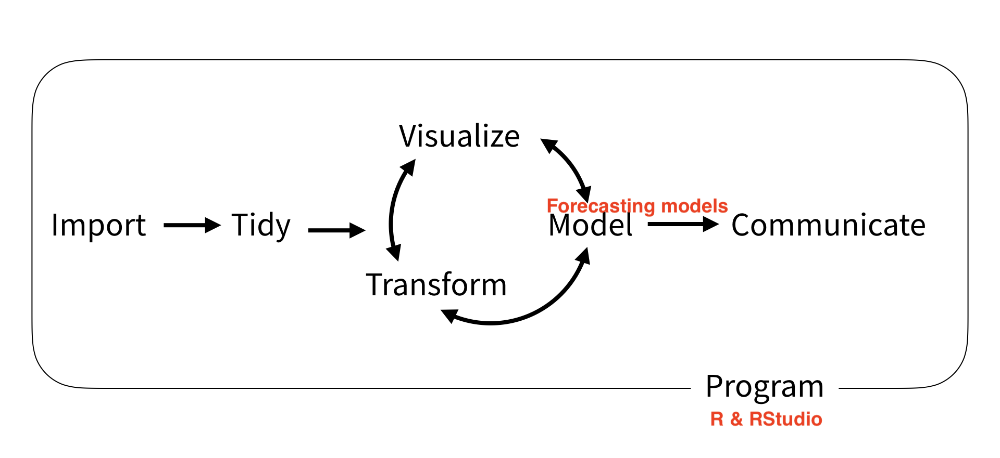
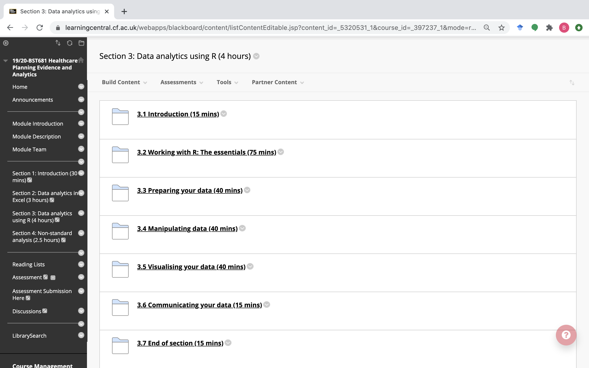
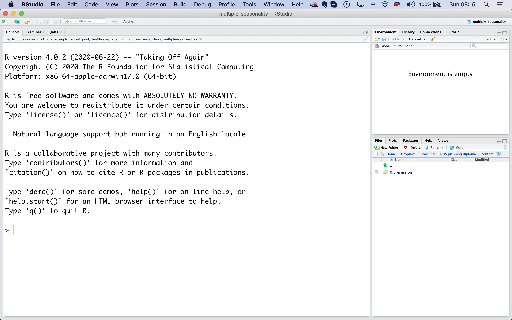
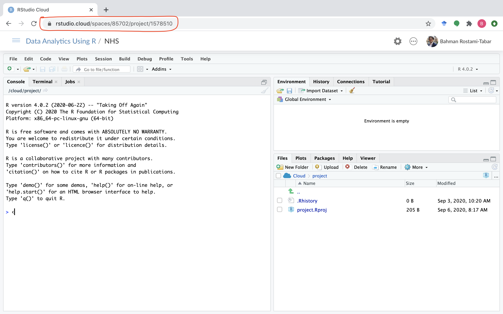
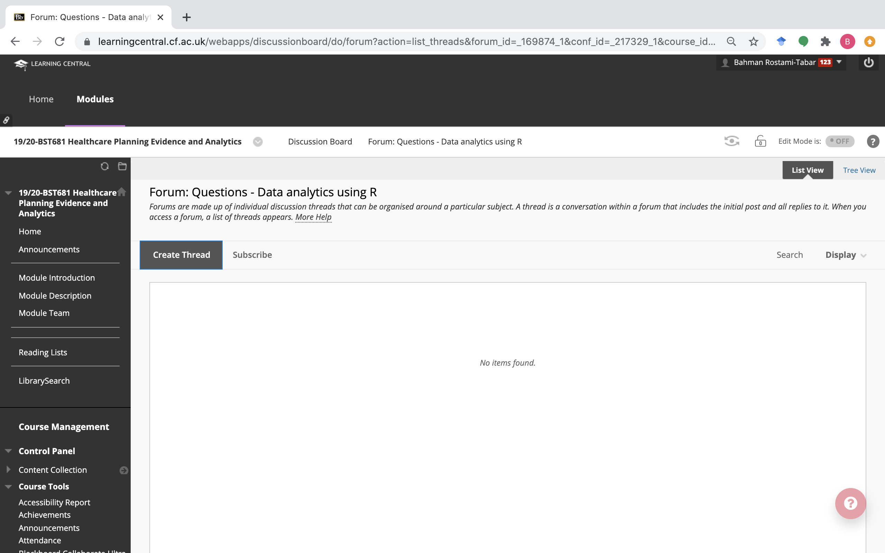
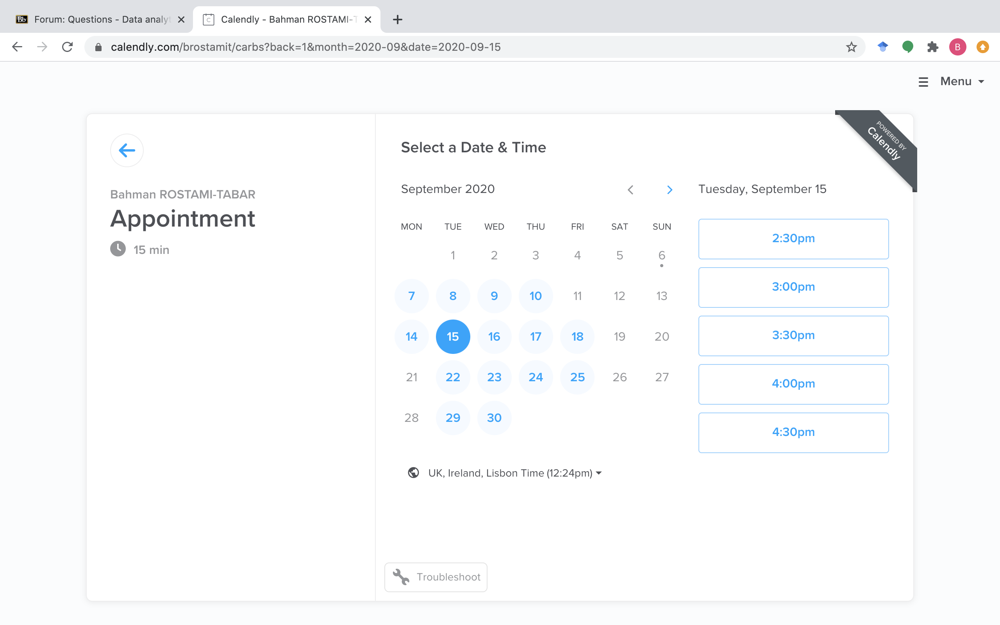

```{r child = "../setup.Rmd"}
```

```{r set-theme, include=FALSE}
library(xaringanthemer)
style_duo_accent(
  primary_color      = "#0077bb", # pantone classic blue0F4C81
  secondary_color    = "#33BBEE", # pantone baby blueB6CADA
  header_font_google = google_font("Raleway"),
  text_font_google   = google_font("Raleway", "300", "300i"),
  code_font_google   = google_font("Source Code Pro"),
  text_font_size     = "30px"
)
```

## Outline

- About me, my teaching, research and & engagement activities
- What will be covered in data analytics R?
- What are the software requirements?
- How learning is evaluated?
- How would you get support?

---
class: middle

.pull-left[
  .huge-text[About]
]
.pull-right[
  .bitlarger[
  me,teaching, research & engagement?
  ]
]

---

.pull-left[
I was born in Paveh, Kurdistan on the border of Iran and Iraq
```{r echo=FALSE, fig.align="center"}

```
]
.pull-right[
Bozin and Marakhil Protected Area(photo taken in 2007)
```{r echo=FALSE, fig.align="center"}

```
]

.footnote[
.tiny[Photos by Bahman Rostami-Tabar.]
]

---

## My education

- BSc. in Industrial Engineering, Iran, 2005
- MSc. in Industrial Engineering, Iran, 2008
- Ph.D. in Industrial Engineering, France, 2014

---

.pull-left[
### Teaching at Cardiff University

- Forecasting
- Business Data Analytics
- Risk Management in supply chains
- Strategic Supply Chain Management
]
--
.pull-right[
### Excecutive and international teaching experience

- Data analytics and forecasting courses in `France, Tunisia, Senegal, Uganda, Nigeria, Indonesia, Iraq, Turkey, and more`
- Associate of `NHS-R` academy, deliver regular workshops on forecasting for NHS
]

---

.pull-left[
### Research interests

- Forecasting for Social Good: e.g. Healthcare, Humanitarian
- The interface of forecasting and decision making
- Data Science, Data Analytics
]
--
.pull-right[
### Engagement

- Organisations: `NHS Wales Delivery Unit, Welsh Ambulance Service Trust, NHS Nottingham and Nottinghamshire CCG, International Committee of the Red Cross, United States Agency for the International Development`
- Forecasting for Social Good (e.g. workshops, grants)
- [Forecasting Book Club](https://github.com/Forecasting-for-Social-Good/Forecasting_Book_Club)
- Democratising forecasting
]

---

class: middle

.pull-left[
  .huge-text[What]
]
.pull-right[
  .larger[
  will be covered?
  ]
]

---
class: middle

## Online sessions (4 hours)

```{r workflow, echo=FALSE, out.width="100%"}

```

---
class: middle

## Face-to-face (1 day)

```{r workflowf, echo=FALSE, out.width="100%"}

```

---
class: middle
```{r workflowr, echo=FALSE, out.width="100%"}

```

---

class: middle
```{r wmaterial, echo=FALSE, out.width="90%"}

```

---

.pull-left[
  .huge-text[Which]
]
.pull-right[
  .larger[
  software?
  ]
]

---
class: middle
```{r randrstudio, echo=FALSE, out.width="100%"}
knitr::include_graphics("img/r-rstudio.png")
```

---

.pull-left[
### R

- R is a programming language
- R may be used without RStudio (not recommended).
]

--
.pull-right[
### Rstudio

- RStudio is a free, open source IDE (integrated development environment) for R
- RStudio allows users to interact with R more readily.
- RStudio can not be used without R.
]

---

.pull-left[
### Rstudio
```{r echo=FALSE, out.width="100%"}

```
]

.pull-right[
### Rstudio Cloud
```{r echo=FALSE, out.width="100%"}

```
]

---

.pull-left[
  .huge-text[Why]
]
.pull-right[
  .larger[
  RStudio Cloud?
  ]
]

---

.pull-left[
### lots of friction points

- Install R
- Install RStudio
- Install the following packages:
  - rmarkdown
  - tidyverse 
  - ...
- Load these packages
]

--
.pull-right[
### much less friction

- Go to rstudio.cloud
- Log in with your Cardiff University account

```{r hello-r, eval=FALSE}
>hello R!
```
]

---

.pull-left[
  .huge-text[How]
]
.pull-right[
  .larger[
  learning is evaluated?
  ]
]

---

## Assignment

- A written report
- It must be written in Rstudio
- It must be transparent and reproducible (using Rmarkdown)
    - I will give you a template
- The assignment brief will be released on Monday $21^{st}$ of September.
---

## What the assignment will consist of?

- Find a dataset (I share a list of public datasets)
- Describe a relevant problem
- Prepare your data
- Transform your data as needed
- Visualise to highlight key patterns
- Apply suitable forecasting models 
- Evaluate forecast accuracy of suggested models
- Communicate results in a reproducible document.

```{r echo=FALSE, out.width="50%", fig.align='center'}
knitr::include_graphics("img/workflow.png")
```

---

.pull-left[
  .huge-text[How]
]
.pull-right[
  .larger[
  to get help?
  ]
]

---

## What support will be provided in and out of class?

We have been allocated 16 hours per cohort for online support sessions

- One live session to debrief the assignment
- 5 live session to answer questions
- Discussion board 
- Individuals/groups by appointment

---

.pull-left[
### [Discussion Board](https://learningcentral.cf.ac.uk/webapps/discussionboard/do/forum?action=list_threads&course_id=_397237_1&nav=discussion_board_entry&conf_id=_217329_1&forum_id=_169874_1)
```{r echo=FALSE}

```
]

.pull-right[
### [Book an appointment](https://calendly.com/brostamit)
```{r echo=FALSE}

```
]

---
```{r echo=FALSE,out.width="50%" ,fig.align="center"}
knitr::include_graphics("img/r_first_then.png")
```

.footnote[
.tiny[illustrations by Allison Horst]
]

---

.hand-large[thank you!]

- Slides are available at [bit.ly/teach-r-online-mats](https://bit.ly/teach-r-online-mats)

- Email [rostami-tabarb@cardiff.ac.uk](mailto:rostami-tabarb@cardiff.ac.uk)

- Website [www.bahmanrt.com](www.bahmanrt.com)

- Twitter [@Bahman_R_T](https://twitter.com/Bahman_R_T)

- [Book an appointment](https://calendly.com/brostamit)